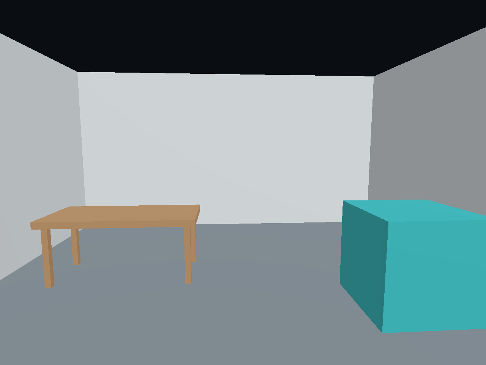

# Validation and milestone checklist

Updated 2026-09-24. Unity 6000.0.66f2 has resolved and compiled the project. The desktop runtime test has loaded and rendered the bundled GLB. **No physical headset tests have been performed.** No authorized Quest was connected over USB during this session.

## Local checks

See [simulator test record](SIMULATOR_TEST.md) for controller-driven alignment, saving, view switching and recovery checks. Restoration initially failed, then succeeded on two simulator launches on September 24. Reliable persistence remains unverified on Quest.

- [x] Official Meta/Unity requirements and package metadata checked; exact direct dependency versions pinned.
- [x] Implemented anchor and project setup calls checked against downloaded Meta Core 205, OpenXR 1.18.0 and XR Management 4.6.1 source signatures.
- [x] Unit/alignment C# compiled and executed using PowerShell's C# compiler: nine test groups passed, including 1,000 random rigid-transform cases.
- [x] Tests cover explicit unit conversion, preventing double conversion, offset origins, yaw direction, 180-degree alignment, preserving scale despite mismatched references, and rejection of invalid reference points.
- [x] C# source syntax and PowerShell script syntax parsed without errors. This does not type-check Unity/package API usage.
- [x] Sample checked with the official Khronos glTF Validator 2.0.0-dev.3.10: **0 errors, 0 warnings, 0 informational issues**. The sample contains 15 mesh instances (180 triangles), with embedded geometry and materials.

## Implemented slice and required verification

| Feature | Scaffold implementation | Verification still required |
|---|---|---|
| GLB import | glTFast behind `IModelLoader`; sample loaded in Unity | On-device sample and real lab GLB |
| Direct 3DM import | Rhino3dm 8.35.0; units, meshes/caches, blocks, basic colors; native reader tests and Unity/simulator sample passed | Physical Android execution, real lab file, larger-model memory, stereo shader appearance |
| True 1:1 scale | Explicit units; fixed placement/rig scale; bounds + floor ruler | Compare tape measurements and model dimensions on Quest |
| Two-point alignment | Floor-ray capture; yaw/translation solution; stick adjustment | Physical landmarks throughout the room |
| Pin and restore | Save UUID + relative transform; localize on restart | Save, force-stop, restart, reboot and relocalize |
| Passthrough / VR | Layer/background switch with shared placement | On-headset rendering and unchanged visual registration |
| Physical walking | Stationary Stage rig; system boundary preserved | Comfort, boundary behavior and room registration |
| Diagnostics | Bounds, import error, anchor state, FPS, measurement | Headset text legibility and meaningful performance readings |

## Next required gates

- [x] Open with Unity 6000.0.66f2, resolve dependencies, and include the generated package lock and asset metadata.
- [x] Run Configure and confirm successful script compilation.
- [x] Actual runtime GLB import: 15 renderers, 6.000 × 3.100 × 8.000 m bounds; rendered sample inspected.
- [x] Desktop two-point placement maps both references, keeps scale at one, and preserves placement across view switches.
- [ ] Check controller-driven interactions and status-panel legibility on Quest.
- [x] Confirm Android OpenXR loader, Meta XR Feature, Touch profile, ARM64, IL2CPP, Vulkan and passthrough/anchor manifest entries.
- [x] Build a development APK successfully.
- [x] Verify the final APK signature with Android apksigner and inspect the packaged Android manifest and ARM64 ABI. See [build record](BUILD_RECORD.md).
- [ ] Complete on-device Meta/OpenXR validation. The build-time OpenXR API patch-version recommendation is documented in SETUP.md.
- [ ] Install on an actual Quest 3S and launch from a cold start.

This image was rendered by the Unity runtime loader during the desktop smoke test. It is not a headset capture.

## Physical Quest 3S test record

Record headset OS version, build version, model fingerprint and measurements. These tests cannot be replaced by editor preview.

1. **Scale:** compare the known 2 m floor span and another independent measured span. Record the expected, displayed and physically observed distances. Verify the cube's height separately. Agree a tolerance appropriate to the lab.
2. **Alignment:** align A/B in passthrough. Compare at least three additional landmarks distributed through the lab; record horizontal and vertical errors. Verify yaw adjustment pivots around A and height adjustment changes no scale.
3. **Persistence:** save, force-stop and reopen. Repeat after reboot and from another starting position within the same room. Confirm passthrough starts first and the model is shown only after successful localization.
4. **Recovery:** test an unavailable original room, lost tracking, a changed export/manifest, an unreadable placement record, and restarting alignment before/after saving. Confirm retry/realign controls remain usable and no stale world pose is presented as a valid anchor.
5. **Mode switch:** alternate passthrough and VR while stationary at a landmark. Confirm the model does not jump, rotate or change scale. Verify X immediately returns to passthrough and the panel remains reachable.
6. **Walking:** with a clear physical route and the system boundary active, walk within the available tracked area. Record alignment error at the far end and after returning. Test the headset boundary and interruption/resume behavior. The model's walls do not establish physical obstacle clearance.
7. **Performance:** test the actual lab export, including textures, for a sustained session. Target at least 72 FPS as a starting acceptance goal; measure with Meta performance tooling, not only the approximate HUD average. Record loading time, dropped frames, memory and thermal behavior. Optimize from these measurements.

No claim of centimeter accuracy, stable whole-lab anchoring, successful persistence, walking comfort or sustained frame rate is made by this scaffold.

## First headset report: v0.2.0 via Meta Horizon Device Manager (2026-09-24)

Reported by the user: v0.2.0 was added from the GitHub release link in Device Manager (work.meta.com), which warned that the app **may not be compatible with shared mode**. It was installed anyway, and on the headset everything worked as expected, with no notifications or errors. This is the first physical Quest run: the Android build installs and launches, and the app is usable despite the shared-mode warning. Individual items (lab import, tape-measured scale, anchor restore after restart, frame rate) have not yet been reported separately; the checklist above still applies.
